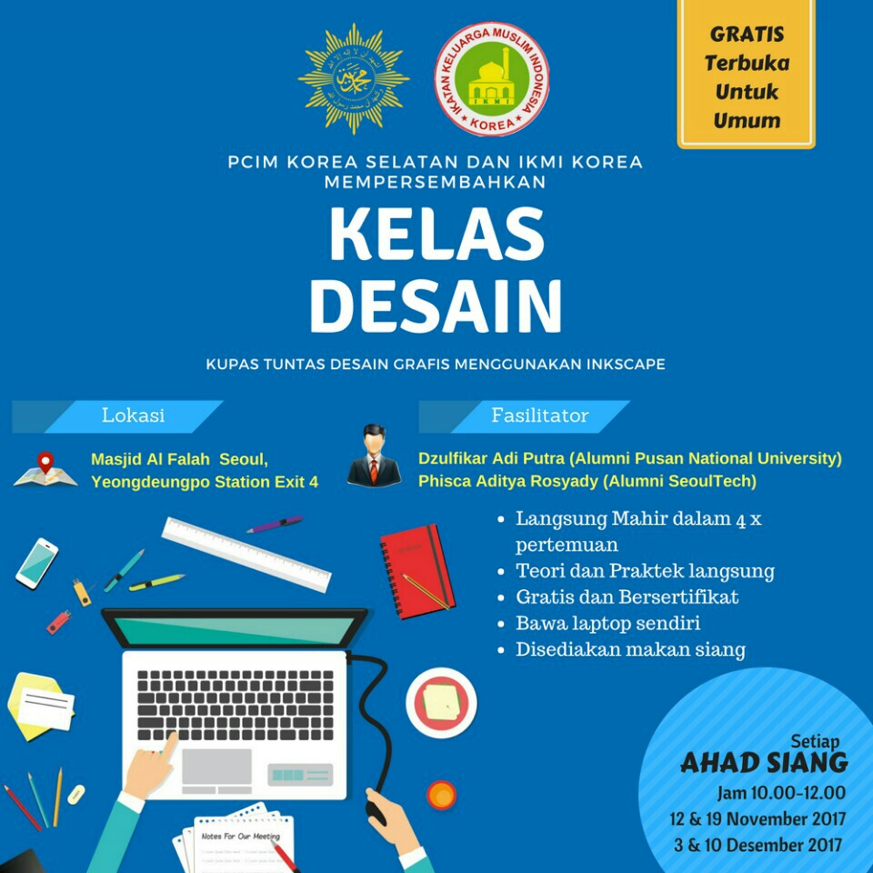

> this repository is written in Indonesian language

# Workshop Inksacpe 2017
Repository ini berisi materi workshop Inkscape yang diadakan pada November-Desember 2017 di Masjid Al Falah, Yeongdeungpo Seoul.

## Galeri Inkscape

- Inkscape Gallery https://inkscape.org/ko/gallery/
- Dribbble users use inkscape https://dribbble.com/search?q=inkscape 
- Behance users use inkscape https://www.behance.net/search?content=projects&sort=appreciations&time=week&search=inkscape 

## Referensi - Bahasa Indonesia

- Layout dasar dalam majalah/poster https://www.slideshare.net/bedubeda/layout-dasar-dalam-majalahposter
- Prinsip dasar tipografi pada desain  https://www.slideshare.net/alfar151/typography-dalam-design
- Tipografi (slide dari SMK BPS&K 2,Teknik Multimedia, Jakarta) https://www.slideshare.net/taramultimedia/tipografi
- Memahami Tipografi Dasar http://virala.id/post/memahami-tipografi-dasar 

## Referensi - English

- Inkscape for Noobs – Part I: The Basics http://vektorrascheln.de/posts/2015/Dec/inkscape-fuer-einsteiger-teil-i-grundlagen-en.html 
- Inkscape for Noobs – Part II: Practice http://vektorrascheln.de/posts/2015/Dec/inkscape-fuer-einsteiger-teil-ii-praxis-en.html
- Good Graphic design and an Introduction to Inkscape https://www.slideshare.net/OmarMohammed45/good-graphic-design-and-introduction-to-inkscape
- Creating a Science Conference Poster with Inkscape https://dionhaefner.github.io/2015/07/creating-a-science-conference-poster-with-inkscape/
- Create a 3-fold brochure - English http://spoken-tutorial.org/watch/Inkscape/Create+a+3-fold+brochure/English/
- Modern Business card design in Inkscape http://goinkscape.com/modern-business-card-design-in-inkscape/
- Inkscape vs Gimp, a vector and raster comparison http://goinkscape.com/inkscape-vs-gimp-a-vector-and-raster-comparison/
- Create a simple and effective ad in inkscape http://goinkscape.com/create-a-simple-and-effective-ad-in-inkscape/ 
- 5 best tips for Inkscape beginners http://goinkscape.com/5-best-tips-for-inkscape-beginners/ 
- Back to School: 28 Easy Inkscape Tutorials https://design.tutsplus.com/articles/back-to-school-28-easy-inkscape-tutorials--cms-21870
- What is the difference between bitmap and vector images?http://etc.usf.edu/techease/win/images/what-is-the-difference-between-bitmap-and-vector-images/